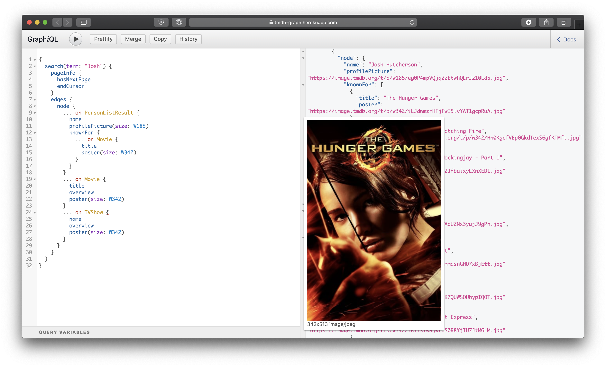

# tmdb



A GraphQL Wrapper for [The Movie Database](https://www.themoviedb.org)...
Available at this heroku [instance](https://tmdb-graph.herokuapp.com). 

Since it's hosted by heroku, it's pretty slow and times out pretty often... It's just a demo...

## How does this work?


This was made using [GraphZahl](https://github.com/nerdsupremacist/GraphZahl) and [Vapor](https://vapor.codes)

## Can I run it locally?

First get an API Key [here](https://www.themoviedb.org/documentation/api).
Clone the repo and run with an API Key in the Environment Variable $API_KEY:

```
git clone https://github.com/nerdsupremacist/tmdb.git
cd tmdb
swift build -c debug
API_KEY={YOUR_API_KEY} ./.build/debug/tmdb
```
